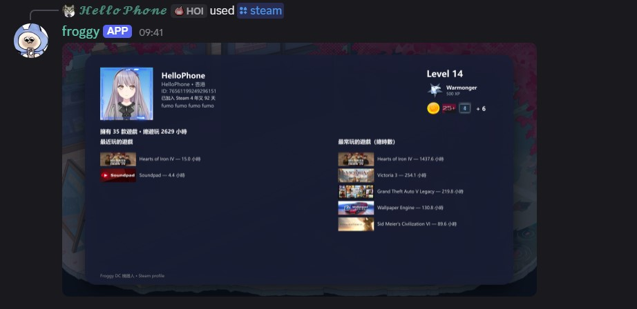
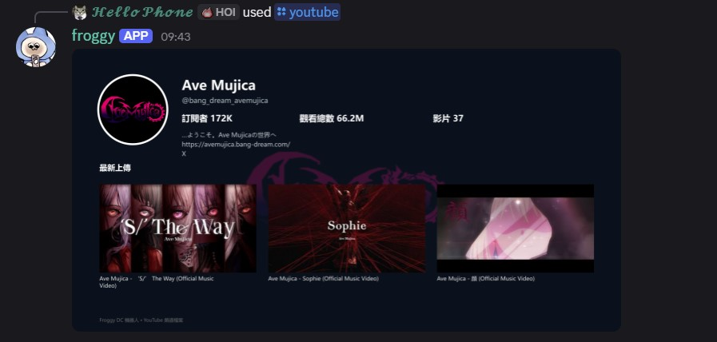
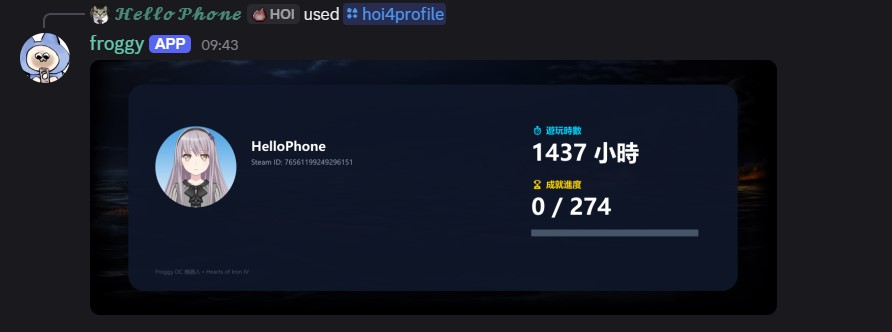

在 Discord 內直接查詢朋友的遊戲數據與頻道狀態。

---

## 1. Steam 主頁查詢

`/steam steamid`：查詢玩家 Steam 檔案與戰績。

:::caution
Steam 個人資料必須設為公開。
:::

**支援格式**：Steam64 ID、自訂網址名稱、完整網址。

_`/steam` 查詢範例_

---

## 2. YouTube 主頁查詢

`/youtube channel`：查詢頻道訂閱與最新影片。

**支援格式**：`@handle`、頻道 ID、完整網址。

_`/youtube` 查詢範例_

---

## 3. Hearts of Iron IV 主頁查詢

`/hoi4profile steamid`：查詢 HOI4 專屬成就與遊玩時間。

**支援格式**：Steam64 ID、自訂網址名稱、完整網址。

_`/hoi4profile` 查詢範例_

---

## 總結

| 指令           | 平台              | 查詢內容                 |
| :------------- | :---------------- | :----------------------- |
| `/steam`       | Steam             | 玩家檔案、時數、徽章     |
| `/youtube`     | YouTube           | 訂閱數、觀看數、最新影片 |
| `/hoi4profile` | Hearts of Iron IV | 成就、遊玩時數           |
